<div align='center'>

# ⏱ 안녕하세요, 60’’ Market 입니다!

</div>

### 🔗 [60’’ Market](https://60-market.github.io/60-market/index.html)

### 💳  **서비스 이용을 위한 계정**

- 📧 **Email** : 60@market.com
- 🔐 **PW** : 60market

### 🗓 프로젝트 기간 : 7월 4일 ~ 7월 29일

<br>
<br>

<div align='center'>

# 💡 INTRO

</div>

```
⏱ 60'' 마켓은 60분 의미를 내포하고 있습니다.

😵‍💫 바쁘다 바빠 현대사회! 몇 번의 터치로 사용자에게 필요한 시간만큼 거래 할 수 있는 온라인 플랫폼 입니다.

💬 구매자는 판매자에게 채팅을 보내 거래를 성사할 수 있습니다.

👥 모든 서비스 사용자는 판매 중인 시간을 구매할 수 있고, 남는 시간을 판매할 수 있습니다.

🙌 또한, 자원 봉사를 위해 시간을 나눔할 수 있습니다.

➕ 관심 있는 사용자를 팔로우 할 수 있습니다.

💜 마음에 드는 게시물에 좋아요를 누르고, 댓글을 달 수 있습니다.
```

<br>
<br>

<div align='center'>

# ❗️Team Members

</div>

<div align='center'>

| 박도겸                                                    | 임홍렬                                                    | 전유진                                                    | 최승수                                                                                                                        |
| --------------------------------------------------------- | --------------------------------------------------------- | --------------------------------------------------------- | ----------------------------------------------------------------------------------------------------------------------------- |
| 사진                                                      | 사진                                                      | 사진                                                      |  |
| moeyg                                                     | Hongryeoll                                                | ujin16                                                    | aydenote                                                                                                                      |
|  |  |  |                                                                      |

</div>

<br>
<br>

<div align='center'>

# 🙌 Role

| 🧑🏻‍💻 박도겸                                                                                                                                                                                                                                                                                                                                                                                                                                                                                                                                                                                                                                                                                                                                                                                                                            |
| ------------------------------------------------------------------------------------------------------------------------------------------------------------------------------------------------------------------------------------------------------------------------------------------------------------------------------------------------------------------------------------------------------------------------------------------------------------------------------------------------------------------------------------------------------------------------------------------------------------------------------------------------------------------------------------------------------------------------------------------------------------------------------------------------------------------------------------ |
| [splash](https://github.com/60-market/60-market/blob/aa0abd9cd1fa62b1d6b4fabce3fc76bf40452196/script/intro.js), [로그인](https://github.com/60-market/60-market/blob/cd56c9a398001f9194571d2cd70ef976f19cea7c/script/logIn.js), [회원가입](https://github.com/60-market/60-market/blob/cd56c9a398001f9194571d2cd70ef976f19cea7c/script/signUp.js), [프로필 설정](https://github.com/60-market/60-market/blob/cd56c9a398001f9194571d2cd70ef976f19cea7c/script/registerProfile.js), [채팅](https://github.com/60-market/60-market/blob/bbb84e344bb1b6bfb845ec6116c978553570a8ba/pages/chat.html), [에러](https://github.com/60-market/60-market/blob/cd56c9a398001f9194571d2cd70ef976f19cea7c/pages/error.html), [로딩](https://github.com/60-market/60-market/blob/cd56c9a398001f9194571d2cd70ef976f19cea7c/css/screens/loadding.css) |

| 🧑🏻‍💻 전유진                                                                                                                                                                                                                                                                                                                                                                                                            |
| -------------------------------------------------------------------------------------------------------------------------------------------------------------------------------------------------------------------------------------------------------------------------------------------------------------------------------------------------------------------------------------------------------------------- |
| [홈피드](https://github.com/60-market/60-market/blob/develop/script/home.js), [검색](https://github.com/60-market/60-market/blob/develop/script/search.js), [좋아요](https://github.com/60-market/60-market/blob/develop/script/home.js), [게시물 수정](https://github.com/60-market/60-market/blob/develop/script/postUpload.js), [게시물 신고](https://github.com/60-market/60-market/blob/develop/script/home.js) |

| 🧑🏻‍💻 최승수                                                                                                                                                                                                                                                                                                                                                                                                                                                             |
| --------------------------------------------------------------------------------------------------------------------------------------------------------------------------------------------------------------------------------------------------------------------------------------------------------------------------------------------------------------------------------------------------------------------------------------------------------------------- |
| [내 프로필 / 상대방 프로필](https://github.com/60-market/60-market/blob/develop/script/profile.js), [프로필 수정](https://github.com/60-market/60-market/blob/develop/script/editProfile.js), [팔로잉 / 팔로우](https://github.com/60-market/60-market/blob/develop/script/profileFollow.js), [게시물 삭제](https://github.com/60-market/60-market/blob/develop/script/profile.js), [로그아웃](https://github.com/60-market/60-market/blob/develop/script/profile.js) |

| 🧑🏻‍💻 임홍렬 |
| --------- |
|           |

</div>

<br>

<div align='center'>

# ⚙️ Stack

</div>

```
🖥 Front : HTML, CSS, Vanilla JS
🎛 Back : 제공된 API 사용
📢 Communication : Notion, Discord

❓ Vanilla JS 로 구현 이유
: 바닐라 자바스크립트를 잘해야 프론트엔드 개발자다 ! 생각했습니다.
: 빠른 시장 변화 속에서도 JS 기본 지식이 탄탄한 개발자는 언제나 주도적인 개발을 할 수 있다고 생각했습니다.
```

<br>
<br>
<div align='center'>

# 🎨 Figma

</div>

[Figma](https://www.figma.com/embed?embed_host=notion&url=https%3A%2F%2Fwww.figma.com%2Ffile%2F0U4P5vP1VCGPehuCue4Hob%2FUntitled%3Fnode-id%3D0%253A1)

<br>
<br>

<div align='center'>

# 🧾 요구사항 명세

</div>

## **[기능]**

```
🔐 인증 : 토큰 기반 로그인, 회원가입, 프로필 설정, 유효성 평가

🌌 게시글 : 게시글 목록, 게시글 등록/수정/삭제, 다중 이미지 파일 업로드/수정/미리보기

🛒 상품 : 상품 목록, 상품 등록/수정/삭제, 이미지 파일 업로드/수정/미리보기, 유효성 평가

💬 댓글 : 댓글 등록/삭제

🔍 검색 : 유저 검색

🤝 follow / unfollow : 유저 팔로우/언팔로우 (구현 예정)

💜 좋아요 : 게시물 좋아요/취소
```

<br>

## **[UI Interaction]**

```
🌊 splash : 로그인 X - 로그인 화면 / 로그인 O - 홈 피드

🎞 이미지 슬라이드 : 커스텀스크롤 구현

🔆 모달 : 애니메이션 키프레임

☑️ 버튼 활성화 : 조건 만족시 활성화
```

<br>
<br>

<div align='center'>

# ✨ Feat : 구현 기능

</div>

<div align='center'>

|                             0.splash                              |                            1.회원가입                             |
| :---------------------------------------------------------------: | :---------------------------------------------------------------: |
| 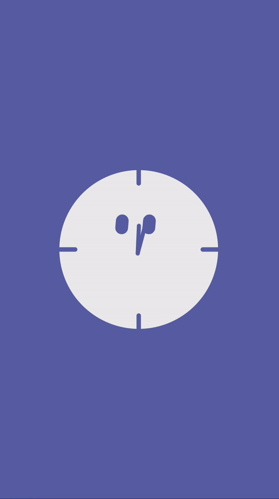 | 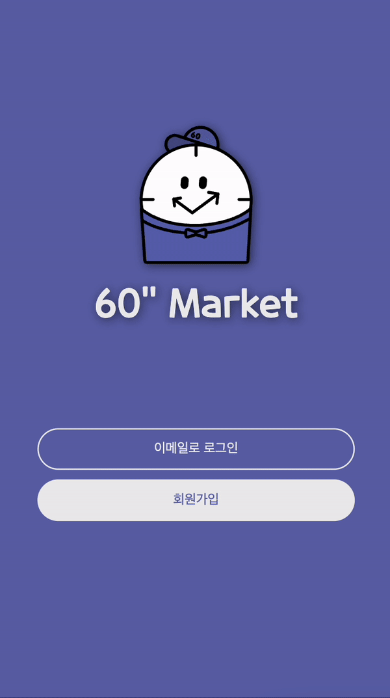 |

|                             2.로그인                             |                               3.프로필 설정                                |
| :--------------------------------------------------------------: | :------------------------------------------------------------------------: |
| 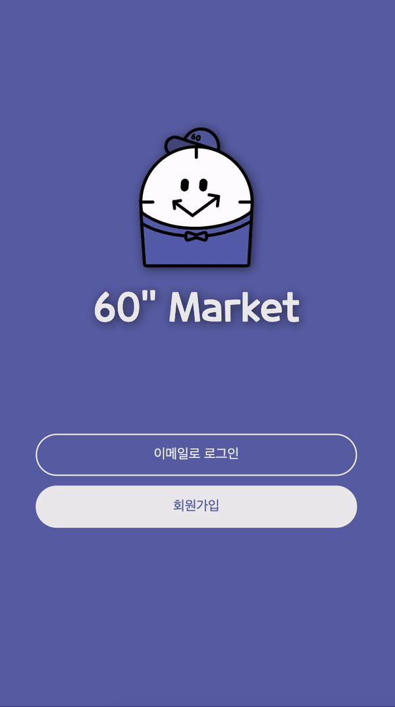 | 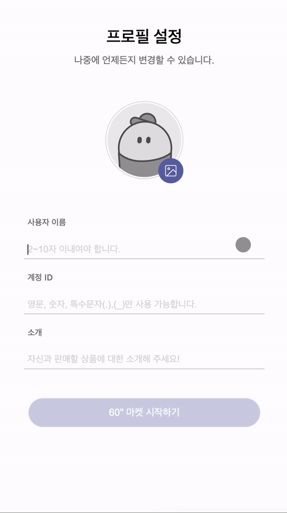 |

|                              4. 검색                              |                           5. 홈 피드                            |
| :---------------------------------------------------------------: | :-------------------------------------------------------------: |
| 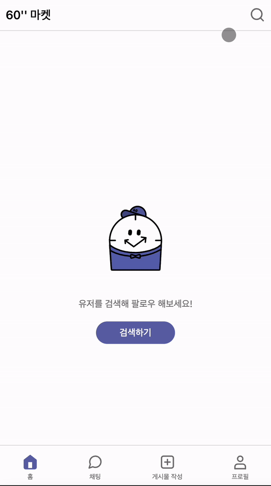 |  |

|                            6. 좋아요                            |                            7. 신고하기                            |
| :-------------------------------------------------------------: | :---------------------------------------------------------------: |
|  |  |

|                           8-1. 게시물 등록                            |                             8-2. 게시물 삭제                             |
| :-------------------------------------------------------------------: | :----------------------------------------------------------------------: |
| 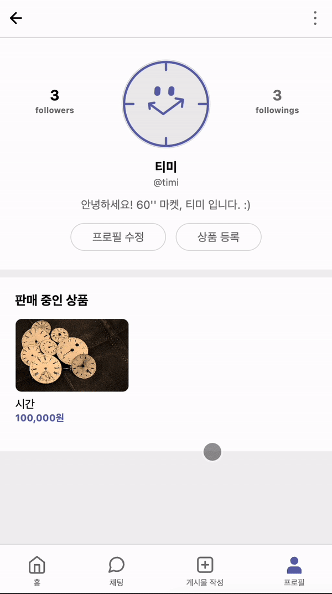 | 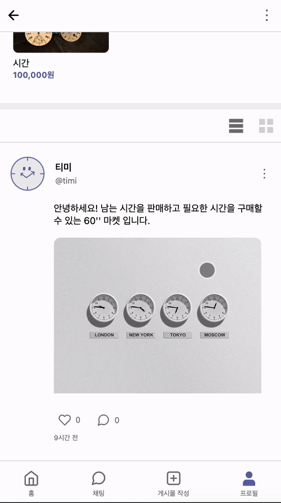 |

|                         8-3. 게시글 댓글 삭제                         |                           9. 판매 상품 등록                           |
| :-------------------------------------------------------------------: | :-------------------------------------------------------------------: |
|  | 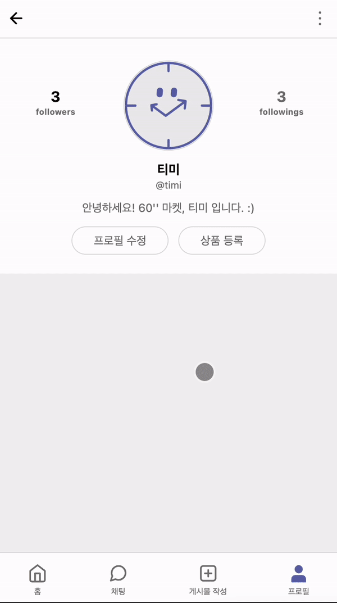 |

|                        10-1. 사용자 프로필 수정                        |                          10-2. 타 유저 프로필                          |
| :--------------------------------------------------------------------: | :--------------------------------------------------------------------: |
| 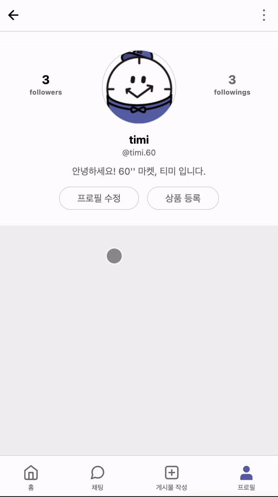 | 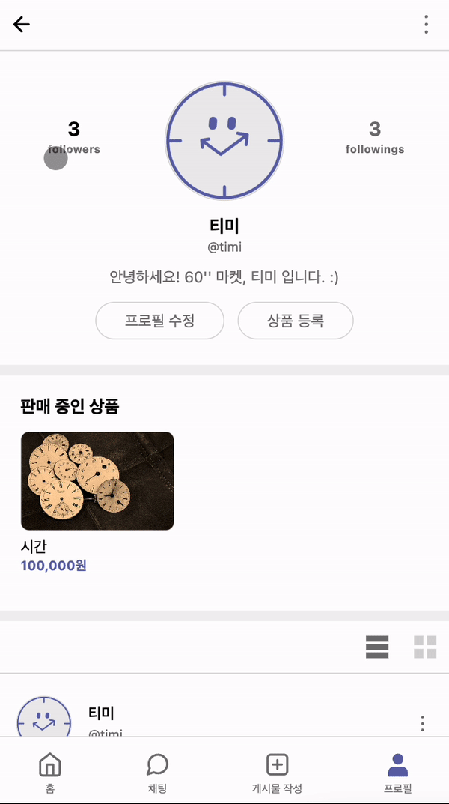 |

|                      11. 팔로잉 팔로워 목록                       |                              12. 채팅                               |
| :---------------------------------------------------------------: | :-----------------------------------------------------------------: |
| 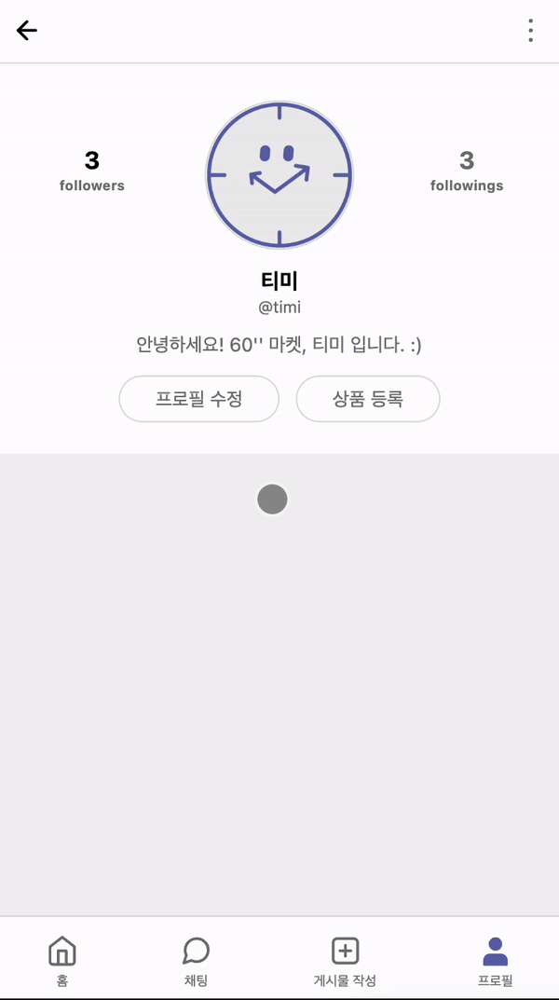 | <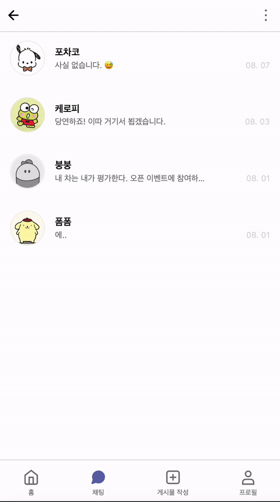 |

|                           13. 로그아웃                            |                              14. 로딩                               |
| :---------------------------------------------------------------: | :-----------------------------------------------------------------: |
|  | 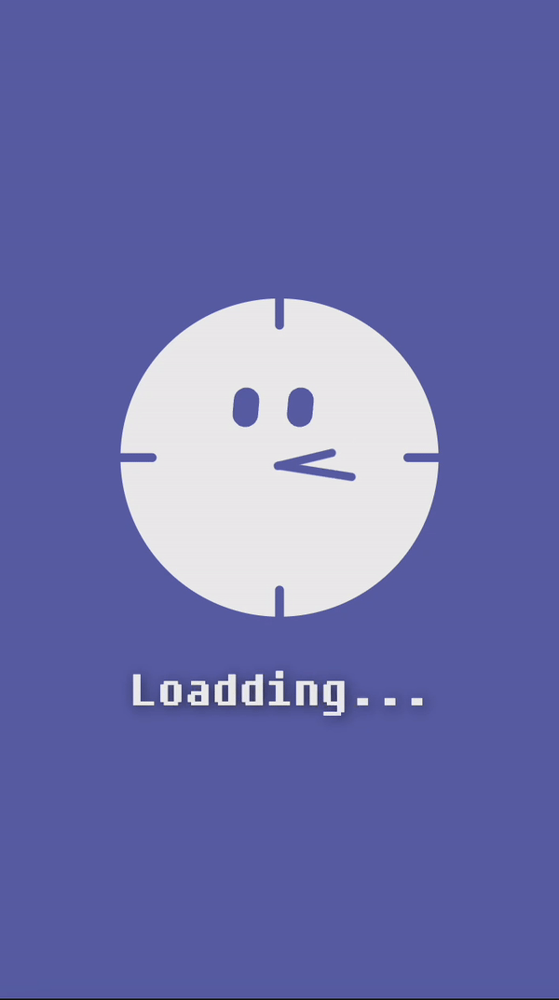 |

<br>
<br>
  
</div>

<div align='center'>

# 🐛 Fix : 개발 이슈

</div>

## 🧑🏻‍💻 박도겸

- 422 에러 : 인터넷 사용 기록 삭제 후, 가입 재시도로 성공했다.
- 프로필 이미지 업로드 미리보기 구현 <br>
  : `URL.createObjectURL(url)` 을 사용해서 구현 중, 이미지를 넣어도 미리보기가 되지 않았다. url 부분에 src가 들어가야 한다는 것을 알고 이미지.src로 해결했다.
  또한, let 변수로 프로필 이미지를 두어 이미지 url 값을 변화할 수 있게 했다.<br> `URL.createObjectURL(url)` 의 단점은 메모리가 계속해서 url을 가지고 있기 때문에 누수가 일어난다는 점이 있다. JavaScript의 경우, malloc을 할 수 없기 때문에 프로필 이미지를 서버에 보낸 후, `URL.revokeObjectURL(url)` 를 통해 메모리 해제를 하여 누수를 방지했다.
- 베이직 프로필<br>
  : 클래스로 구역을 나누어 놓았기 때문에, 베이직 프로필을 이미지 업로드 클래스에 넣을 수가 없었다. 이미지를 설정하지 않으면 서버에서 지정해 놓은 이미지로 전환이 되는데, 팀 내에서 설정한 베이직 프로필을 담아 보내고 싶었다. 따라서 설정한 이미지가 undefined일 경우 베이직 이미지의 filename을 넣어(`profileImg = '1658636863237.png'`) 해결했다.
- 서버에 이미지 보내기 <br>
  : 이미지를 주소 자체로 서버에 전송이 되지 않아서 `new FormData()` 를 이용해 이미지를 form 형식으로 전환한 후, post 할 때, body에 값을 넣어주었다.
- 정규 표현식 - 폼 입력 시, 예외 문자 처리 (`const regExp = /^[a-zA-Z0-9_.]{2,10}$/`)<br>
  : 처음에 `regExp = /^[a-zA-Z0-9_.]/` 으로 설정했는데, 예외 처리한 문자를 입력해도 아무런 반응이 없었다. 그래서 {2, 10} 으로 최대 최솟값을 지정해 예외 처리를 할 수 있었다.

<br>

## 🧑🏻‍💻 임홍렬

<br>

## 🧑🏻‍💻 전유진

- 시멘틱한 태그로 맞추기 위한 `<header></header><main></main><footer></footer>` 제안
- 고정 높이값
- 웹접근성을 고려
  - input과 label
  - article, section태그의 헤딩태그를 전부 줘야하는가?
  - 텍스트가 없는 버튼태그에 ir기법
- a태그 내부의 버튼태그
- normal flow에 속한 요소들은 normal flow에서 벗어난 float, position 속성이 적용된 요소들을 인식하지 못함(메인 헤더, 푸터 인식 못함 해결)
- 쿼리스트링
- 의미없는 디자인요소 img/ backround-image
- 앵커태그와 DOM컨트롤 할 때의 차이점
- 유저 검색기능 중복 결과

<br>

## 🧑🏻‍💻 최승수

- 이슈 : 내 프로필과 다른 사람 프로필 페이지 마크업 및 기능 유사.  
  해결 : 내 프로필과 다른 사람 프로필 페이지 마크업 및 기능 유사하여 쿼리스트링과 로컬 스토리지에서 `accountname`을 가져와 비교 후 하나의 html 파일에서 마크업 및 기능 구현.
- 이슈 : 프로필 수정 페이지에서 이미지 변경 없을 경우 기존 이미지 전송  
  해결 : 이미지 변경이 없다면 `document.querySelector("").src`와 `if`문을 사용하여 기존 이미지를 가져와 전송.

# 🌱 Folder Tree

```
⏱ 60market
┃
┣ 📝 README.md
┣ 📝 .gitignore
┣ 📄 index.html
┃
┣ 📂 asset
┃ ┣ 📂 font
┃ ┣ 📂 gif
┃ ┗ 📂 image
┃   ┣ 📂 icon
┃   ┣ 📂 navIcon
┃   ┣ 📂 postImage
┃   ┣ timi.svg
┃   ┣ favicon.ico
┃   ┗ 그 외 이미지 파일
┃
┣ 📂 css
┃	 ┣ 🎨 reset.css
┃	 ┣ 🎨 styles.css
┃	 ┣ 🎨 variable.css (root css)
┃	 ┗ 📂 components
┃	 ┃ ┣ 🎨 chatEnter.css
┃	 ┃ ┣ 🎨 headerBar.css
┃	 ┃ ┣ 🎨 modal.css
┃	 ┃ ┣ 🎨 modalAlert.css
┃	 ┃ ┣ 🎨 navBar.css
┃	 ┃ ┗ 🎨 userList.css
┃	 ┗ 📂 screens
┃	   ┣ 🎨 addProduct.css
┃	   ┣ 🎨 chat.css
┃	   ┣ 🎨 chatting.css
┃	   ┣ 🎨 editProfile.css
┃	   ┣ 🎨 home.css
┃	   ┣ 🎨 homeNotFollow.css
┃	   ┣ 🎨 loadding.css
┃	   ┣ 🎨 main.css
┃	   ┣ 🎨 post.css
┃	   ┣ 🎨 postUpload.css
┃	   ┣ 🎨 profile.css
┃	   ┣ 🎨 profileFollow.css
┃	   ┗ 🎨 register.css
┃
┣ 📂 pages
┃	 ┣ 📄 addProduct.html
┃	 ┣ 📄 chat.html
┃	 ┣ 📄 chatting.html
┃	 ┣ 📄 editProfile.html
┃	 ┣ 📄 error.html
┃	 ┣ 📄 home.html
┃	 ┣ 📄 intro.html
┃	 ┣ 📄 loadding.html
┃	 ┣ 📄 logIn.html
┃	 ┣ 📄 post.html
┃	 ┣ 📄 postUpload.html
┃	 ┣ 📄 profile.html
┃	 ┣ 📄 profileFollow.html
┃	 ┣ 📄 registerProfile.html
┃	 ┣ 📄 search.html
┃	 ┗ 📄 signUp.html
┃
┗ 📂 script
	 ┣ 🟡 addProduct.js
	 ┣ 🟡 common.js
	 ┣ 🟡 editProfile.js
	 ┣ 🟡 home.js
	 ┣ 🟡 index.js
	 ┣ 🟡 intro.js
	 ┣ 🟡 logIn.js
	 ┣ 🟡 post.js
	 ┣ 🟡 postUpload.js
	 ┣ 🟡 profile.js
	 ┣ 🟡 profileFollow.js
	 ┣ 🟡 registerProfile.js
	 ┣ 🟡 search.js
	 ┗ 🟡 signUp.js

```
